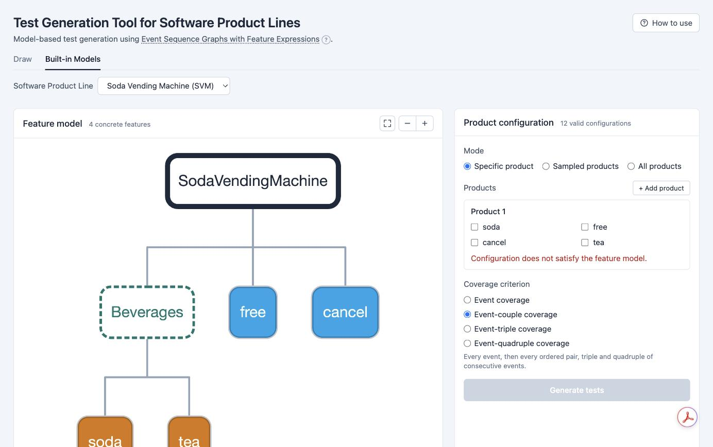

# Test Generation Tool for Software Product Lines

Model-based test generation for software product lines using **Event Sequence
Graphs with Feature Expressions (ESG-Fx)** — a single behavioural model that
captures every product in a line. Pick or draw a model, choose which products to
cover and how thoroughly, and generate test suites in the browser.

**Live demo:** https://test-generation-tool-for-spls.onrender.com



## What it does

- Loads an ESG-Fx model — a feature model plus an event graph whose events carry
  Boolean feature expressions over the features.
- Derives the behaviour of a single product, a sample of products, or every
  product of the line.
- Generates test suites for four coverage criteria: **event**, **event-couple**,
  **event-triple** and **event-quadruple** coverage.
- Samples product configurations by exact **enumeration**, or by **UniGen**
  (almost-uniform SAT sampling) for lines too large to enumerate.
- Lets you **draw or import** a model, edit it live, **highlight** a test on the
  graph, and export the model (XML / PNG / JPG / PDF) or the suite (CSV).

## Running it

### Use the live demo

Open the URL above. It runs on a free instance, so the first request after a
period of inactivity may take about 40 seconds to wake.

### Run the container

Reproduces the exact environment, UniGen included. Needs Docker.

```
git clone --recurse-submodules https://github.com/dilekozturk93/esg-with-feature-expressions-web
cd esg-with-feature-expressions-web
docker build -t esgfx-web .
docker run --rm -p 8080:8080 esgfx-web
# then open http://localhost:8080/
```

### Build from source

Needs JDK 17 and Maven.

```
git clone --recurse-submodules https://github.com/dilekozturk93/esg-with-feature-expressions-web
cd esg-with-feature-expressions-web
mvn -DskipTests package
java -jar target/esgfx-web-0.1.0-SNAPSHOT.jar
# then open http://localhost:8080/
```

The engine lives in the `lib/esg-core` submodule. If a build stops with
`lib/esg-core is empty`, the clone omitted submodules — run
`git submodule update --init --recursive`. UniGen is optional: it needs
`pyunigen` for the Python the app invokes; without it, enumeration sampling
still works.

## Using it

1. **Choose a model** — a bundled example under *Built-in Models*, or *Draw* to
   build one from scratch or import your own `FM.xml` + `ESG-Fx.mxe`.
2. **Pick what to generate** — a specific product, a sample, or all products.
3. **Choose a coverage criterion.**
4. **Generate** — read the suite on the right, click a row to highlight its path
   on the ESG-Fx graph, and export it as CSV.

Inside the app, the **How to use** button and the **?** beside *Event Sequence
Graphs with Feature Expressions* explain the workflow and the model itself.

## How it is built

Spring Boot 3 / Java 17 serving a Thymeleaf and vanilla-JavaScript front end,
with [Cytoscape.js](https://js.cytoscape.org/) for the graphs. The
test-generation engine is a separate research codebase, included as the
`lib/esg-core` submodule; the web layer is a thin wrapper over its API and does
not reimplement generation. All front-end libraries are served from the
application, so it runs without internet access.

## Verification

- The web output is checked against the original research pipeline's ground
  truth for every product of the bundled lines (308/308 match).
- `python3 scripts/smoke_test.py <url>` drives a running instance end to end —
  bundled models, single/all/sampled generation, and UniGen.
- `docs/TEST_PLAN.md` is a manual acceptance checklist covering the interface.

## License

MIT — see [LICENSE](LICENSE).

## Citation

> Öztürk, Tuğlular and Belli, "Software Product Line Testing based on Event
> Sequence Graphs with Feature Expressions," 8th International Conference on
> Computer Science and Engineering, 2023.
